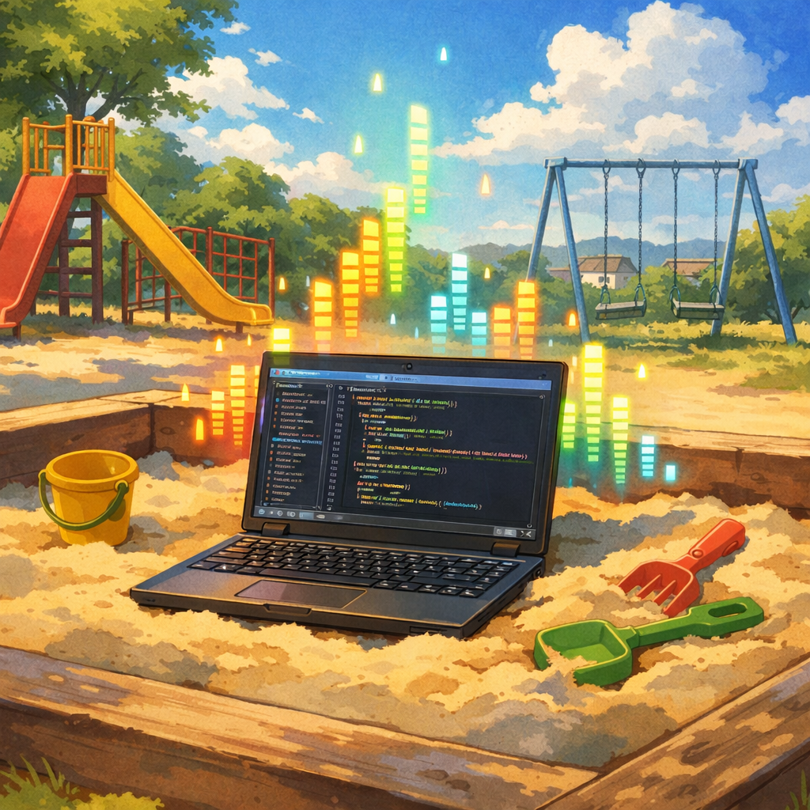

# Human Replay

**Vibe without guilt. Replay with understanding.**



Vibe coding is intoxicating. You describe what you want, the AI builds it, you iterate at superhuman speed. In three hours, you have a working feature that would have taken two weeks.

But then you look at the code. It works. Mostly. But it's not *yours*. You don't fully understand it. There are abstractions you wouldn't have chosen. There are subtle bugs hiding in components that were never tested together.

You face a choice: accept the entropy, or throw it away and lose the insight. **There is a third path.**

The AI's value isn't the code it writes—it's the *problems it solves* and the *approaches it discovers*. **Code is cheap. Understanding is expensive.**

The Human Replay method separates exploration from integration. Let the AI explore freely in a sandbox. Then replay its discoveries with your own hands, in your own style, with your own understanding.

The AI explores. You integrate. The map becomes territory you've walked yourself. Your codebase stays yours.

See [`human-replay-manifesto.md`](.claude/skills/vibe-coding/human-replay-manifesto.md) for the full philosophy.

<br clear="both">

## What This Does

This repo contains pre-defined skills and agents to help you vibe-code with Claude Code. Create a sandbox, kick off your vibe coding with the /vibe-coding skill, passing in your instructions or design doc.

After the LLM vibe codes a solution, use the replay-guide-generator agent to analyse the final state. It generates an **optimal rebuild path** - the route a knowledgeable pair programmer would take from the start.

```
Vibe Freely      →   Replay Guide Generator   →   Human Replay
(AI explores)        (analyzes final state)       (you rebuild with understanding)
```

## Quick Start

### 1. Set Up a Sandbox

Copy your repo to a throwaway workspace for vibe coding:

```bash
cp -r /path/to/your-repo ~/sandbox/my-feature
cd ~/sandbox/my-feature
git remote remove origin  # Prevent accidental pushes
```

### 2. Add Agents and Skills to Your Project

Copy the `.claude/` folder to your actual project:

```bash
cp -r .claude/ ~/sandbox/my-feature/.claude/
```

### 3. Vibe Code

Work freely in your sandbox using the /vibe-coding skill. Provide a design doc and let the AI iterate, explore, test and refactor. Don't worry about clean commits—this is research.

### 4. Generate Your Replay Guide

When you're happy with the result, just ask Claude:

```
Generate a replay guide for this session. Base commit: abc123
```

That's it. Claude will analyze the diff, cluster changes by concern, order by dependencies, and write a guide to `replay-guides/`.

## What You Get

The generated guide in `replay-guides/{name}.md` includes:

- **Overview** — What was built, key decisions, files affected
- **Dependency Graph** — Mermaid diagram showing build order
- **Phased Steps** — Grouped by layer (Data Models → Core Logic → API → Tests)
- **Domain-Specific Retrospectives** — Step-specific reflection prompts tailored to your codebase type (frontend, backend, database, infra, real-time, ML, CLI)
- **Checkpoints** — Understanding checks and design critiques between phases

Each step includes a **Retrospective** section with questions like:
- *"What happens to `UserSession` if the token expires mid-request?"*
- *"Will this query use an index, or will it table scan?"*
- *"What's the failure mode if the external service is unavailable?"*

These force you to think critically—not just copy code—and catch edge cases the LLM might have missed.

## License

MIT
