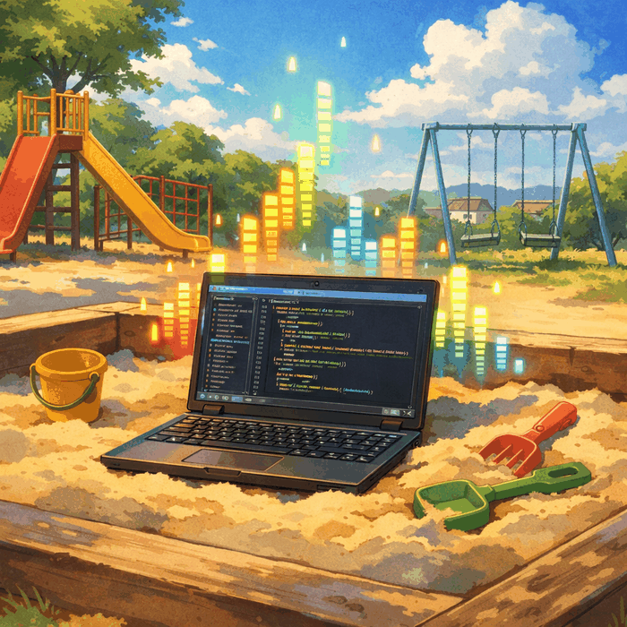

# Human Replay

**Vibe without guilt. Replay with understanding.**



Vibe coding is intoxicating. You describe what you want, the AI builds it, three hours later you have a feature that would have taken two weeks.

Then you read the code. It works. Mostly. Abstractions you would never pick. Fields the AI declared and never read. Bugs hiding in the seams between components nobody tested together.

Two options. Ship the entropy, or throw it away and lose the insight. Both are bad.

There is a third path.

Code is cheap. Understanding is expensive. The AI's value is the *exploration*, not the code that came back with it. Let it explore freely in a sandbox. Then replay its discoveries with your own hands, in your own style, with your own understanding.

The AI explores. You integrate. The map becomes territory you walked yourself. Your codebase stays yours.

Read more:

- [`human-replay.md`](human-replay.md) for the method in full
- [`critique-of-brute-force-ai.md`](critique-of-brute-force-ai.md) for why pure agentic loops like RALPH devalue real engineering
- [`workshop-takeaways.md`](workshop-takeaways.md) for what to take and leave from Anthropic's Claude Code workshop playbook

<br clear="both">

## What this is

A bundle of Claude Code skills, agents, and a sandbox-discipline hook that operationalize Human Replay. You vibe in a throwaway. The orchestrator spawns a researcher, grills you on system invariants, then runs autonomous phases. When you are done, the replay-guide generator analyzes the final state and produces an ordered rebuild path.

```
SANDBOX → GRILLING → AUTONOMOUS PHASES → REPLAY GUIDE → REAL CODEBASE
  AI       You          AI                 AI            You
```

## Quick start

### 1. Set up the sandbox

Easiest path: invoke `/vibe-prep` from the original repo and let it walk you through. It asks where to put the sandbox (default `~/sandbox/[repo-name]-[feature-slug]`), copies the repo, activates the hook.

Manual equivalent:

```bash
cp -r /path/to/your-repo ~/sandbox/your-repo-feature
cd ~/sandbox/your-repo-feature
touch .sandbox  # marker. activates the sandbox-discipline hook.
```

You do not need `git remote remove origin`. The hook blocks `git push` and origin rewrites from any directory containing a `.sandbox` marker. Keeping the origin reference lets you `git fetch` to compare against upstream when useful.

### 2. Copy the agents and skills

```bash
cp -r .claude/ ~/sandbox/your-repo-feature/.claude/
```

### 3. Vibe

Open Claude Code in the sandbox and invoke `/vibe-coding`. Provide a design doc or feature description.

What happens, in order:

1. **Researcher.** Explores the codebase. Surfaces candidate system invariants and links to existing architecture docs. Returns a brief.
2. **Grilling** (vendored from [`mattpocock/skills`](https://github.com/mattpocock/skills)). The orchestrator interrogates you one question at a time until every branch of the decision tree is resolved and the system invariants list is approved. Spend 30 minutes here to save 3 hours later.
3. **Phases.** The orchestrator breaks work into 2 to 4 hour phases. Each phase: implementer, three validators (integration, design conformance, code architecture), commit, state update.
4. **Wrap.** When you say done, Claude asks whether to generate the replay guide or run more tweaks first. You decide.

### 4. Generate the replay guide

```
Generate a replay guide for this session. Base commit: abc123
```

The replay-guide generator reads `docs/SESSION_STATE.md` and `docs/[feature-slug]-progress.md` first, then the diff. Output goes to `replay-guides/{name}.md`.

### Checking in mid-run

A vibe session can run autonomously for hours. Invoke `/vibe-status` at any point to get a one-screen summary: current phase, completed phases, active stubs, recent commits, system invariants in effect. Read-only, never modifies state.

## What the replay guide contains

- **Overview.** What was built, key decisions, files affected.
- **System Invariants.** Verbatim from grilling. These hold across the entire feature, every phase below is bound by them.
- **Dependency graph.** Mermaid diagram showing build order.
- **Phased steps.** Grouped by layer (Data Models → Core Logic → API → Tests).
- **Domain-specific retrospectives.** Reflection prompts tailored to the codebase type (frontend, backend, database, infra, real-time, ML, CLI).
- **Checkpoints.** Understanding checks and design critiques between phases.

Each step has a Retrospective like:

- *"What happens to `UserSession` if the token expires mid-request?"*
- *"Will this query use an index, or will it table scan?"*
- *"What is the failure mode if the external service is unavailable?"*

These force critical reading. Catch the edge cases the LLM missed.

## Sandbox discipline

One deterministic hook ships in `.claude/hooks/sandbox-guard.sh`. Fires when `.sandbox` is present at the repo root.

**Pre-tool-use guard.** Blocks `git push`, `git remote add origin`, and `git remote set-url origin` from inside a sandbox. Sandboxes are throwaway. Replay in your real working copy and push from there.

Claude cannot talk its way past it. Disable by removing the marker.

Replay-guide generation is *not* automated. At the end of a session Claude asks whether to generate it or run more tweaks first. You decide when the work is settled.

## License

MIT
